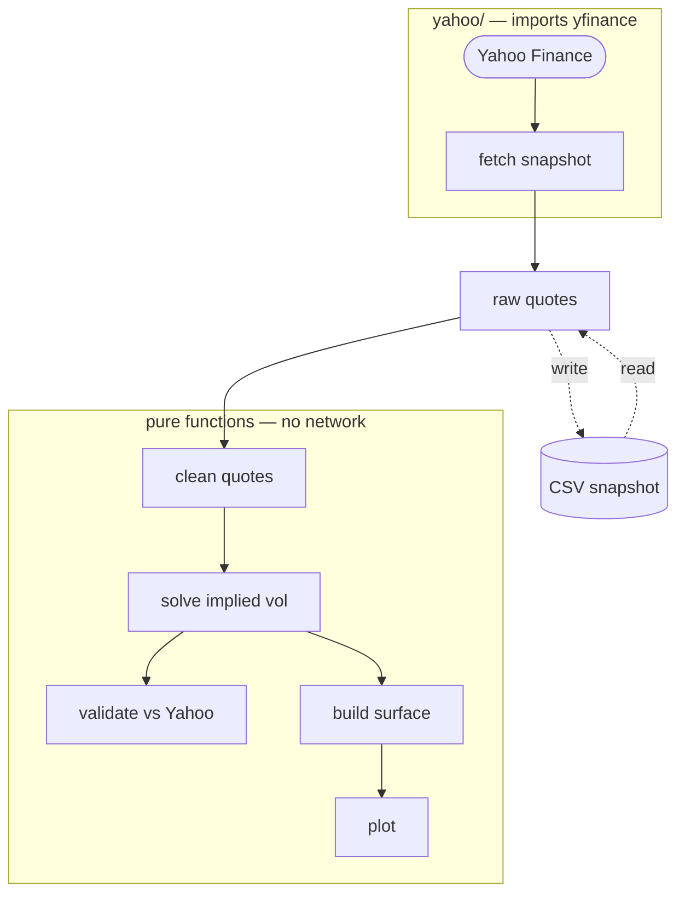

# OptionsEngine and Implied Volatility Surface

This project uses the Black-Scholes formula to price options, calculate the Greeks,
and solve for implied volatility. Everything is written from scratch. It pulls live
SPX option data from Yahoo Finance (through the `yfinance` package) and uses it to
build an implied volatility surface.


*Built from a single snapshot of the SPX option chain. Interactive version:
[figures/sample_surface.html](figures/sample_surface.html).*

## Architecture



`yfinance` is only used in one place, at the very start of the pipeline, and all it
does is return a plain DataFrame of raw quotes. Everything after that point is
ordinary functions with no network access: cleaning the quotes, solving for implied
volatility, building the surface, and plotting. This split has a few nice
consequences.

- The pricer and the solver were written and fully tested before any live data was
  pulled. None of the tests need internet.
- The same raw DataFrame can be written to a CSV snapshot. The rest of the pipeline
  runs identically whether the quotes come from a live pull or from a saved file, so
  the whole project can be demoed offline from the committed sample snapshot.
- If the data ever needs to come from somewhere other than Yahoo, for example a
  broker API, the only code that has to change is `fetch_snapshot()` in
  `optionsengine/yahoo/`, the function that talks to `yfinance` and returns the raw
  DataFrame. Nothing downstream changes, because everything downstream only ever sees
  that DataFrame.

## The parts

### Pricing and the Greeks

The pricer is plain Black-Scholes for a European call or put. The model assumes no
dividends, a constant risk-free rate, and constant volatility. The "Limitations and
assumptions" section below goes through what each of these costs.

$$
C = S\,N(d_1) - K e^{-rT} N(d_2) \qquad P = K e^{-rT} N(-d_2) - S\,N(-d_1)
$$

$$
d_1 = \frac{\ln(S/K) + (r + \sigma^2/2)\,T}{\sigma\sqrt{T}} \qquad d_2 = d_1 - \sigma\sqrt{T}
$$

Two edge cases are handled before the formula runs. If the option has already
expired ($T = 0$) it is worth its intrinsic value. If volatility is zero there is no
uncertainty left, so the payoff is known and just needs discounting: the call is
worth $\max(S - Ke^{-rT},\,0)$, with the strike discounted because it is not paid
until expiry. Getting this second case right matters because it is the lower bound
the IV solver leans on.

The five Greeks (delta, gamma, vega, theta, rho) are the closed-form derivatives of
the price with respect to each input. Rather than just re-deriving them by hand and
trusting the algebra, each one is tested against a central finite difference of the
pricer itself, so a sign slip or a missing term shows up as a failed test. Gamma and
vega take no option type because they are identical for a call and a put with the
same strike and expiry.

Walkthrough with plots: [notebooks/01_pricer_greeks.ipynb](notebooks/01_pricer_greeks.ipynb).

### The implied volatility solver

Implied volatility is the volatility that makes the Black-Scholes price equal the
price seen in the market. There is no formula for it. Black-Scholes goes from
volatility to price and cannot be rearranged the other way, so the solver has to
search for the value that fits.

It searches in two ways. First it tries Newton-Raphson, which uses the slope of
price against volatility (that slope is vega) to jump close to the answer in a few
steps. If Newton misbehaves, for example by stepping to a negative volatility or
stalling, the solver switches to bisection. Bisection just halves an interval that
is known to contain the answer, over and over. It is slower but it cannot fail, as
long as the answer really is inside the starting range.

A few things make it more reliable than a naive loop:

- **The starting guess is calculated, not hard-coded.** It uses the
  Brenner-Subrahmanyam approximation, which is exact at the money and roughly right
  elsewhere. That is good enough for a starting point and better than always
  starting from 0.20.
- **The range is checked before solving.** Price rises with volatility, so if the
  market price is below the price at 0.01% vol or above the price at 500% vol, no
  volatility fits and the solver returns a failed result with the reason, rather
  than a wrong number.
- **Vega is checked at the answer.** If the price barely changes with volatility
  near the solution, many different volatilities fit the price about equally well,
  and whichever one the solver landed on is not meaningful. When that happens the
  result is marked failed instead.

Every result also records which method solved it. That is what makes it possible to
report how often the fallback was needed. On the committed sample snapshot the split
is **54% Newton, 46% bisection**. The bisection cases are the options with little
time left and strikes far from the money, which is exactly where vega gets small and
Newton struggles.

The numbers and the reasoning: [notebooks/02_iv_solver.ipynb](notebooks/02_iv_solver.ipynb).

### Live data

The live data is SPX index options, pulled from Yahoo Finance with `yfinance`. No
account or broker connection is needed. SPX was chosen because its options are
European and cash-settled, which is what the Black-Scholes model assumes. SPY
options, by contrast, are American and can be exercised early, so pricing them this
way would be wrong.

The raw chain is large and mostly not useful, so a few filters run before anything
is solved.

- **Which contracts.** SPX lists two roots for the same underlying: `SPXW` (weekly,
  settles at the 16:00 close) and `SPX` (monthly, settles at the 09:30 open). Where
  a date has both, `SPXW` is kept because it is more liquid. For the longest
  expiries in the window there is no `SPXW` contract listed yet, so `SPX` is used
  there.
- **Which strikes and expiries.** Only moneyness `K/F` between 0.80 and 1.20, and
  time to expiry between one week and one year. `F` is the forward price.
- **Which quotes.** The price used is the mid, `(bid + ask) / 2`, never the last
  traded price, which is often stale outside market hours. Quotes with a missing bid
  or ask, a crossed bid/ask, or a spread wider than half the mid are dropped. Only
  out-of-the-money options are kept: calls above the forward, puts below. That is
  where the market is tightest, so the implied vol is cleaner.
- **Time to expiry.** Measured in hours, from the exact moment of the quote to the
  contract's real settlement time, then converted to years on an ACT/365 basis. Not
  whole calendar days, and not measured from the current wall-clock time.

More detail: [notebooks/03_live_surface.ipynb](notebooks/03_live_surface.ipynb).

### The surface

For a single expiry date, implied volatility is not one number. It changes with the
strike: options far from the money usually price at a higher vol than options near
the money. Plotting implied vol against strike for one expiry gives a curved line,
called the volatility smile. The surface is those smiles for every expiry, lined up
next to each other and ordered from the nearest expiry to the furthest.

Two choices in how it is built:

- **The x-axis is log-moneyness, `ln(K/F)`, not the raw strike.** The forward `F` is
  different for each expiry, so a strike of 5000 is not in the same place on a
  one-week smile as on a one-year smile. Log-moneyness lines the smiles up so that 0
  is at the money for all of them.
- **Each expiry's smile is interpolated only from that expiry's own quotes.** The
  interpolation is a PCHIP spline, which is shape-preserving, so it does not add
  wiggles that the data does not show. Outside the range of strikes actually quoted
  for an expiry, the surface is left blank rather than guessed at.

The image at the top of this README is a static render. A self-contained interactive
version is at [figures/sample_surface.html](figures/sample_surface.html): download it
and open it in a browser to rotate and hover for values. GitHub shows only the HTML
source, not the rendered page.

Full build, and a look at where the solved IV disagrees with Yahoo's own reported
IV: [notebooks/03_live_surface.ipynb](notebooks/03_live_surface.ipynb).

## Results

| Check | Result |
|---|---|
| Test suite | 715 tests pass, no network needed |
| Textbook cross-check | Matches Hull's worked example: call 4.76, put 0.81 |
| Put-call parity | Holds to within 1e-6 across the pricer and all five Greeks |
| Solver split | 54% Newton, 46% bisection on the committed sample snapshot |
| Solved IV vs Yahoo's IV | MAE 0.0155, RMSE 0.0185 (see the note in Limitations) |

Put-call parity is the main correctness check. It comes from a no-arbitrage
argument, not from Black-Scholes, so it tests the pricer without assuming the
formula it is checking. The Greeks are checked against finite differences of the
pricer for the same reason: an independent check catches sign and factor mistakes
that re-deriving by hand would not.

## Limitations and assumptions

Black-Scholes is a simple model and this is a deliberately simple version of it.
Here is where it does not match reality, and which way the error goes.

- **Constant volatility.** This is the central assumption of the model, and the
  surface this project builds is a direct picture of it being false. If implied vol
  really were constant, the surface would be flat. It clearly is not: it varies with
  both strike and expiry.
- **Constant risk-free rate.** The rate is set once in the config file at 4%, not
  pulled from live data.
- **No dividends.** SPX pays a dividend yield of around 1% a year, and the model
  ignores it. The effect is small but systematic: modelled call prices come out
  slightly low and put prices slightly high. SPX was chosen partly because it has
  the lowest dividend yield of the obvious index candidates, so this shortcut is
  cheapest here.
- **European exercise.** The model assumes the option can only be exercised at
  expiry. This is true for SPX, which is why it was chosen over SPY.
- **Frictionless markets.** No transaction costs, borrowing and lending at the same
  risk-free rate with no limit, and no arbitrage.
- **Mid price as fair value.** The width of the bid/ask spread carries information
  about liquidity and uncertainty, and using the mid throws that away.
- **Delayed quotes.** Yahoo's data lags the real market. It is not a live feed.
- **No arbitrage-free surface fit.** The surface is interpolation only. A surface
  used by a real trading desk would also enforce no-calendar-arbitrage and
  no-butterfly-arbitrage constraints, for example with an SVI parametrisation.
- **Yahoo's reported IV is not a clean benchmark.** Yahoo does not publish how it
  computes its implied vol, and it may be based on a slightly different quote moment
  than the bid/ask shown next to it. So the MAE and RMSE above mix the model's own
  error with Yahoo's method and timing.

The natural next steps would be American exercise through a binomial tree, and other
underlyings such as NDX, RUT, or XSP. The symbol is already isolated in
`config.py`, so adding an index is mostly a config change.

## Getting started

```bash
git clone https://github.com/samvandiermen/OptionsEngine
cd OptionsEngine
pip install -r requirements.txt

python -m pytest tests/ -q            # 715 tests, no network needed

jupyter lab notebooks/                # walkthrough, runs from the committed sample

python scripts/fetch_snapshot.py      # pull a fresh SPX snapshot (needs internet and open markets)
python scripts/live_surface.py        # fetch, solve, plot, refresh on Enter
```

Built and tested with Python 3.14, numpy, scipy, pandas, plotly, and yfinance.

## Project layout

| Path | What it does |
|---|---|
| `optionsengine/pricing.py` | Black-Scholes price, `d1`/`d2`, forward price |
| `optionsengine/greeks.py` | All five Greeks, closed form |
| `optionsengine/implied_vol.py` | Newton-Raphson with a bisection fallback |
| `optionsengine/config.py` | Symbol, rate, chain window, per-underlying settings |
| `optionsengine/yahoo/` | The only code that imports yfinance |
| `optionsengine/quotes.py` | Mid price, dropping bad quotes, OTM selection |
| `optionsengine/validation.py` | Solved IV vs Yahoo's, error by bucket and method |
| `optionsengine/surface.py` | Per-expiry smile interpolation into a surface grid |
| `optionsengine/plotting.py` | The 3D surface, individual smiles, term structure |
| `scripts/` | CLI entry points: fetch a snapshot, run the live view |
| `notebooks/` | Pricer and Greeks, solver behaviour, the live surface |
| `tests/` | 715 tests, synthetic data only, no network |

---
