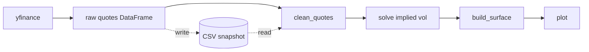
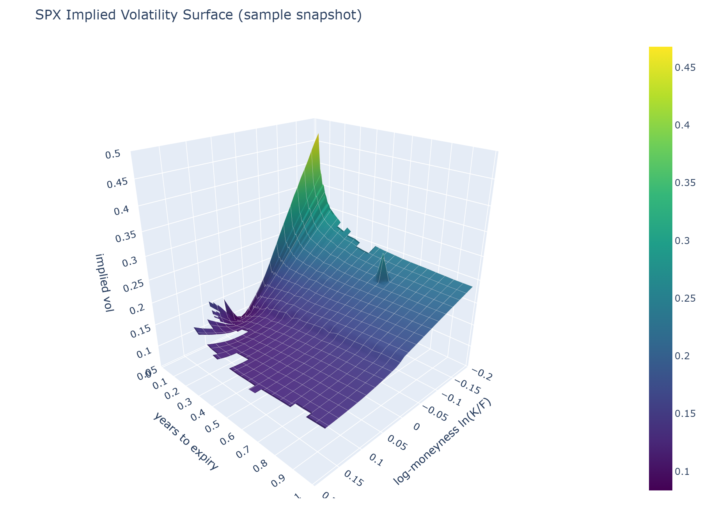

# OptionsEngine

A Black-Scholes options pricer, Greeks, and implied volatility solver, built from
scratch and run against a live SPX option chain to produce an actual implied
volatility surface.

## Architecture



`yfinance` lives at the edge of the codebase and only ever produces a plain
DataFrame. Everything downstream, cleaning, solving, building the surface, is pure
functions with no network dependency. Every one of them is unit-tested against
synthetic data. The same CSV snapshot that yfinance produces live is what the
notebooks and the committed sample run from offline. Core pricing and the solver
were built and fully tested before any live data was ever pulled.

## The model

Plain Black-Scholes: a European call or put, no dividends, constant volatility,
constant interest rate.

$$
C = S \, N(d_1) - K e^{-rT} N(d_2) \qquad\qquad
P = K e^{-rT} N(-d_2) - S \, N(-d_1)
$$

$$
d_1 = \frac{\ln(S/K) + (r + \sigma^2/2)\,T}{\sigma\sqrt{T}} \qquad\qquad
d_2 = d_1 - \sigma\sqrt{T}
$$

All five Greeks are closed-form derivatives of the same formula, and every one is
checked against a central finite difference of the price function itself, not just
re-derived by hand:

$$
\Delta = \frac{\partial V}{\partial S} \qquad
\Gamma = \frac{\partial^2 V}{\partial S^2} \qquad
\nu = \frac{\partial V}{\partial \sigma} \qquad
\Theta = \frac{\partial V}{\partial T} \qquad
\rho = \frac{\partial V}{\partial r}
$$

Full walkthrough, including the zero-volatility and zero-time edge cases the pricer
handles specially: [notebooks/01_pricer_greeks.ipynb](notebooks/01_pricer_greeks.ipynb).

## Implied volatility solver

There's no closed form for implied volatility. Black-Scholes turns a volatility into
a price, and that can't be reversed algebraically. So the solver searches for it
instead. It tries Newton-Raphson first, since it converges in just a handful of
iterations. If Newton's step becomes unreliable, it falls back to bisection.

Matching the market price isn't enough on its own. Where vega is near zero, an
option's price barely moves with volatility. Many different volatilities would fit
the same price equally well, so whatever Newton lands on there doesn't actually mean
anything. Every solve checks vega at its own answer and rejects it if the price was
too flat to trust in the first place. On the committed sample snapshot, the real split is
**54% Newton, 46% bisection**. That's not a bug. Bisection cases are the ones with
little time left and far from the money, exactly where vega collapses. See
[notebooks/02_iv_solver.ipynb](notebooks/02_iv_solver.ipynb) for the numbers and why.

## Live data

SPX index options are European and cash-settled, so the model's European-exercise
assumption genuinely holds here (SPY, by contrast, is American). They're pulled live
with `yfinance`. No account or brokerage connection needed.

- Both the `SPXW` (weekly, PM-settled) and `SPX` (monthly, AM-settled) contract
  roots are in scope. Where a date lists both, `SPXW` is kept as the more liquid
  one. `SPX` is the fallback once SPXW's own weekly calendar runs out.
- Chain window: moneyness `K/F` in `[0.80, 1.20]`, time to expiry from one week to
  one year.
- Mid price only, `(bid + ask) / 2`, never last traded, since that can be stale.
  Quotes with a missing, crossed, or too-wide bid/ask are dropped. Only
  out-of-the-money options are kept, calls above the forward and puts below, since
  that's where quotes are tightest.
- Time to expiry is measured in hours, from the quote's own moment to the
  contract's real settlement time. Not whole days, and not the wall clock.

See [notebooks/03_live_surface.ipynb](notebooks/03_live_surface.ipynb).

## The surface

Each expiry's own smile is interpolated separately: log-moneyness `ln(K/F)` against
implied vol, using a shape-preserving PCHIP spline. The smiles are then stacked into
one surface. A vol surface is a term structure of smiles, not one undifferentiated
cloud of points. No expiry ever borrows information from another's strikes, and
nothing is ever extrapolated past what an expiry's own quotes actually cover.



The static image above is a screenshot of a real Plotly figure. A self-contained,
interactive version of the same surface is committed at
[figures/sample_surface.html](figures/sample_surface.html). Download it and open it
in a browser to rotate, zoom, and hover for exact values. GitHub only shows the HTML
source inline, it won't render the page itself.

Full build, plus a look at where our solved IV disagrees with Yahoo's own:
[notebooks/03_live_surface.ipynb](notebooks/03_live_surface.ipynb).

## Results

| Check | Result |
|---|---|
| Test suite | 715 tests passing, no network needed |
| Textbook cross-check | Matches Hull's worked example (call 4.76, put 0.81) |
| Put-call parity | Holds to 1e-6 across the full pricer and Greeks |
| Solver split | 54% Newton, 46% bisection, on the committed sample snapshot |
| IV vs Yahoo | MAE 0.0155, RMSE 0.0185 (see caveats below) |

## Limitations and assumptions

- **Constant volatility.** The core Black-Scholes assumption. The surface this
  project plots directly contradicts it: implied vol clearly varies with strike and
  time, or there'd be nothing to build a surface out of.
- **Constant risk-free rate.** Set once in config, not fetched live.
- **No dividends.** SPX yields roughly 1.2-1.4% a year, so this puts a small,
  systematic downward tilt on modelled call prices and an upward tilt on puts.
  Chosen deliberately. SPX has the lowest dividend yield of the obvious index
  candidates, which makes this the cheapest place to take the shortcut.
- **European exercise.** SPX is cash-settled and
  European-style, which is exactly why it was chosen over SPY.
- **Frictionless markets.** No transaction costs, unlimited borrowing and lending
  at the risk-free rate, no arbitrage.
- **Mid price as fair value.** Ignores anything the width of the spread itself
  might say about liquidity or uncertainty.
- **Delayed quotes.** Yahoo's data lags the real market. It isn't a live feed.
- **No arbitrage-free surface fit.** Interpolation only. A production surface would
  also enforce no-calendar and no-butterfly-arbitrage constraints. SVI is one way
  to do that.
- **Yahoo's IV is not a clean baseline.** Its methodology is undisclosed. It may
  also reflect a slightly different quote moment than the bid/ask sitting next to
  it, so the comparison mixes model error with Yahoo's own method and timing.

## Possible extensions

- American exercise via a binomial tree, for non-index underlyings
- Additional underlyings: `config.py` already separates the symbol from the
  pipeline, so NDX, XSP, or RUT can easily be added for instance.

## Getting started

```bash
git clone https://github.com/samvandiermen/OptionsEngine
cd OptionsEngine
pip install -r requirements.txt

python -m pytest tests/ -q            # 715 tests, no network needed

jupyter lab notebooks/                # walkthrough, runs from the committed sample

python scripts/fetch_snapshot.py      # pull a fresh SPX snapshot (needs internet)
python scripts/live_surface.py        # fetch, solve, plot, refresh on Enter
```

Built and tested with Python 3.14, numpy, scipy, pandas, plotly, and yfinance.

## Project layout

| Path | What it does |
|---|---|
| `optionsengine/pricing.py` | Black-Scholes price, `d1`/`d2`, forward price |
| `optionsengine/greeks.py` | All five Greeks, closed form |
| `optionsengine/implied_vol.py` | Newton-Raphson with a bisection fallback |
| `optionsengine/config.py` | Symbol, rate, chain window, per-underlying settings |
| `optionsengine/yahoo/` | The only code that imports yfinance |
| `optionsengine/quotes.py` | Mid price, dropping bad quotes, OTM selection |
| `optionsengine/validation.py` | Our IV vs Yahoo's, error by bucket and method |
| `optionsengine/surface.py` | Per-expiry smile interpolation into a surface grid |
| `optionsengine/plotting.py` | The 3D surface, individual smiles, term structure |
| `scripts/` | CLI entry points: fetch a snapshot, run the live view |
| `notebooks/` | Pricer and Greeks, solver behaviour, the live surface |
| `tests/` | 715 tests, synthetic data only, no network |

---
